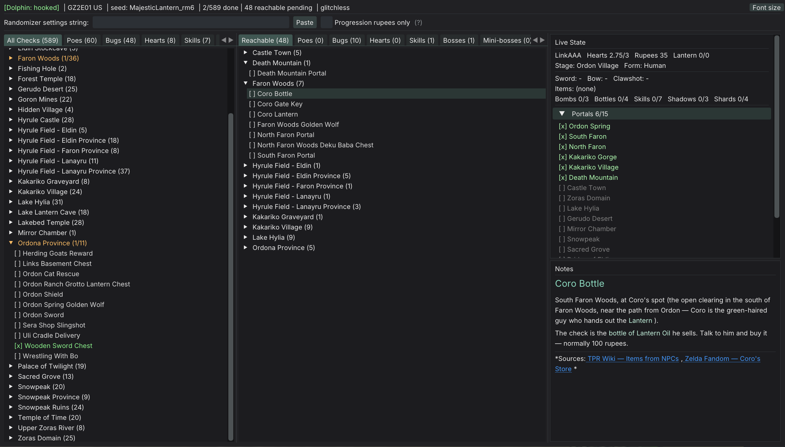

# Gleed's tracker
(WIP version 0.1)

Auto-tracker that automatically tracks your progress in Twilight Princess and Ocarina of Time by reading the memory of your emulator or application.

Mostly windows-only. Twilight Princess on Dolphin should work in Linux, but I haven't tested it.

Supports Dolphin and Dusk for Twilight Princess. Supports Project64 for Ocarina of Time, but I plan to eventually have full emulator coverage (this amounts to adding new MemorySource implementations, relatively self-contained).

The design of the application is different from other trackers. Instead of offering a graphical map, it's designed for having all checks and reachable checks always visible in front of you, with explanations for what you have to do for each check.



The goal is to have explicit support for the TP and OOT randomizers. So for example, the tracker can switch automatically pick between glitch or glitchless logic if you provide your randomizer's settings string. Various randomizer settings are also deduced automatically.

# Current Status
Current status: Initial implementation. Basic functionality works, but proper functioning of the logic etc. has only been tested haphazardly (I haven't played full playthroughs with either). A lot of checks are probably miscategorized or superfluous (e.g. having separate boss checks + boss and dungeon reward checks).

Certain adaptions to randomizer logic is already in. For example, in Twilight Princess, rupees are by default filtered out of the checks unless the tracker detects you have rupee shuffling in your randomizer setup. But most of it is missing.

Ocarina of Time is a really early implementation, most of logic does not function properly at the moment. 


## Build

**Requirements:** Windows + MSVC (Visual Studio 2022), CMake ≥ 3.21, Git.

```bash
git clone https://github.com/gleedgleed/gleeds-tracker.git
cd gleeds-tracker
cmake -B build
cmake --build build --config RelWithDebInfo
```

Binary lands at `build/bin/RelWithDebInfo/tptracker.exe`.

Pre-built releases will come with 1.0. 

# AI usage notice
Most of the 'typing' of code here was done by AI. I still guided it excessively manually in a most cases. I have a full time job and this is more or less a weekend vibe coding project. But I paid next to 0 attention to its coding style - it has a lot of 'modern cpp-isms' that I would have written very differently if I typed out the code manually.

# Attributions
Check attributions.md for the crucial list of project's I referenced. They turned this from a major reverse engineering effort into something that can comfortably be done as a side project.
